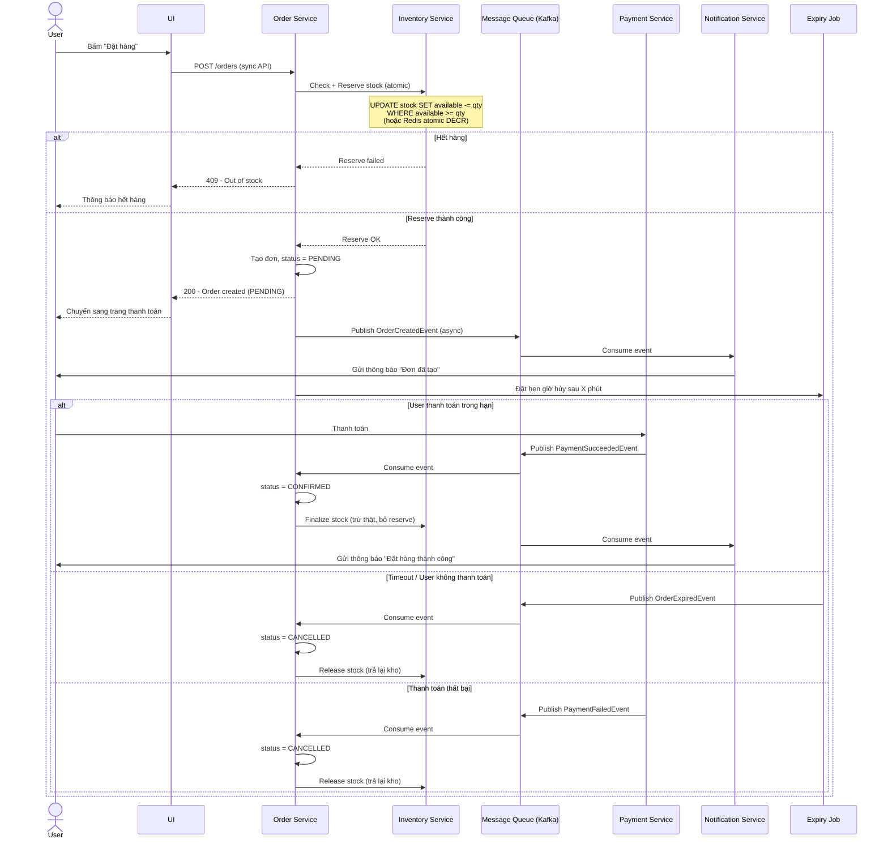

# Luồng Đặt Hàng Chuyên Nghiệp (Order Placement Flow)

Sequence diagram mô tả luồng xử lý khi user bấm "Đặt hàng" trong hệ thống e-commerce (kiểu Shopee/Lazada), bao gồm reserve stock, xử lý event bất đồng bộ, timeout và xác nhận thanh toán.

## Sequence Diagram

## Giải thích các bước chính

### 1. Check + Reserve (đồng bộ)
Khi user bấm đặt hàng, hệ thống **không chỉ check** mà phải **giữ chỗ (reserve)** số lượng ngay lập tức bằng thao tác atomic để tránh race condition khi nhiều người mua cùng lúc.

### 2. Publish event (bất đồng bộ)
Sau khi reserve thành công, các bước tiếp theo (thông báo, đồng bộ dữ liệu...) được xử lý qua Kafka/Message Queue, không chặn user.

### 3. Cơ chế hết hạn (Expiry/TTL)
Đơn ở trạng thái `PENDING` có thời hạn (VD: 15 phút). Nếu không thanh toán kịp, một job hẹn giờ sẽ tự động hủy đơn và **release** hàng đã giữ trở lại kho khả dụng.

### 4. Xác nhận cuối cùng
Chỉ khi thanh toán thành công, hệ thống mới **finalize** — trừ thật số lượng trong kho và chuyển đơn sang `CONFIRMED`.

## Bảng trạng thái đơn hàng

| Trạng thái | Ý nghĩa | Kho hàng |
|---|---|---|
| `PENDING` | Đơn vừa tạo, chờ thanh toán | Đã reserve (available giảm) |
| `CONFIRMED` | Thanh toán thành công | Đã trừ thật (actual giảm) |
| `CANCELLED` | Hết hạn hoặc thanh toán thất bại | Đã release (available tăng lại) |

## Ghi chú kỹ thuật

- **Atomic reserve**: dùng DB constraint (`WHERE available >= qty`) hoặc Redis Lua script để đảm bảo không bị race condition.
- **Saga Pattern**: vì transaction trải qua nhiều service (Order, Inventory, Payment), nên dùng Saga (choreography qua event như trên, hoặc orchestration với 1 coordinator) để đảm bảo consistency khi có lỗi giữa chừng.
- **Idempotency**: các consumer (Inventory, Notification...) cần xử lý idempotent vì Kafka có thể deliver trùng message.
